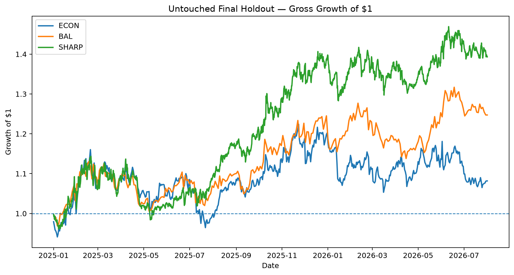
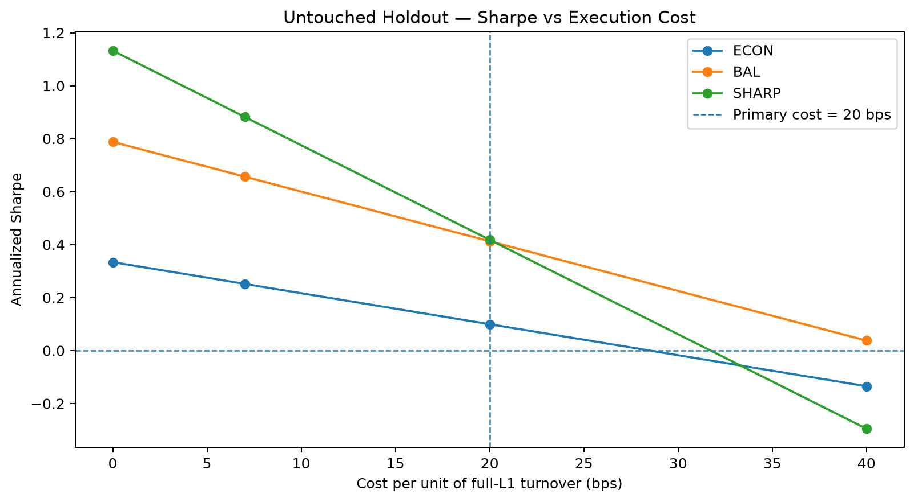

# Crypto Alpha Across Horizons

[](https://github.com/owensimonfive/crypto-alpha-across-horizons/actions/workflows/tests.yml)

**Cross-sectional momentum, reversal, and continuation research in a 24/7 crypto market**

This repository documents an end-to-end quantitative research project built around a simple question:

> **Does relative past crypto performance predict relative future performance across horizons, and can that relationship survive realistic portfolio construction, turnover, transaction costs, and genuinely out-of-sample testing?**

The project uses a **point-in-time monthly top-25 universe of liquid Binance spot USDT pairs**, exact elapsed-price endpoints, neutral long-short portfolios, full-L1 turnover, and a primary execution-cost assumption of **20 bps per unit of turnover**.

## Headline result

A promising cross-sectional momentum signal **failed its frozen 2023–2024 validation**. Rather than treating that as an endpoint, the failure became the catalyst for a redesign using only pre-2025 information.

That redesign uncovered a distinct **multi-week cross-sectional continuation** architecture. Three exact implementations — representing different tradeoffs between economic resilience, balance, and risk-adjusted performance — were frozen before the untouched final test:

| Finalist | Philosophy | Mapping | Formation | Holding | Cadence |
|---|---|---|---:|---:|---:|
| **ECON** | Economic resilience | Continuous rank | 2w | 6w | 24h |
| **BAL** | Balanced | Equal-weight terciles | 3d | 8w | 48h |
| **SHARP** | Higher Sharpe | Equal-weight terciles | 1d | 8w | 8h |

All three passed the predeclared survival rule in the untouched **2025-01-01 through 2026-08-01 exclusive** holdout.

### Untouched holdout performance



The three implementations are different expressions of the same continuation factor rather than independent alphas. SHARP delivered the strongest gross holdout performance, BAL produced the strongest realized execution-cost cushion, and ECON represented the slower, more cost-conscious implementation philosophy.

| Finalist | Mean IC | Gross Sharpe | Net-20 Sharpe | Break-even cost |
|---|---:|---:|---:|---:|
| ECON | 0.0484 | 0.33 | 0.10 | 28.5 bps |
| BAL | 0.0466 | 0.79 | 0.41 | **42.0 bps** |
| SHARP | 0.0368 | **1.13** | **0.42** | 31.7 bps |

**Primary conclusion:** despite the original validation failure, the redesigned continuation effect generalized across **3 / 3 pre-frozen implementations** in the untouched holdout. Realized economic strength was weaker than in the pre-2025 evaluation, but all three retained positive continuation IC, positive gross economics, and break-even costs above the primary 20-bps assumption.

### Execution-cost sensitivity



The 20-bps vertical marker is the project's locked primary cost assumption. BAL retained the largest realized cost cushion, while SHARP retained the strongest gross holdout Sharpe but was more turnover-sensitive.

## Why the research process matters

This project is intentionally not a “find the best backtest and present it” exercise.

Key safeguards include:

- point-in-time universe membership to reduce survivorship bias;
- a fixed train / validation / final-holdout chronology;
- exact elapsed-price endpoints rather than approximate shifted bars;
- no return or price forward-filling across missing exchange timestamps;
- portfolio weights earning only subsequent returns;
- full-L1 turnover and turnover-proportional costs;
- broad-surface / neighboring-parameter interpretation rather than single-cell optimization;
- explicit preservation of failed hypotheses;
- reproduction gates before opening later samples;
- no post-holdout parameter rescue, beta hedge, asset exclusion, or ensemble fitting.

The original validation failure is part of the final research record, not something hidden by the later redesign.

## Research path

The public notebooks are organized by **research logic**, not by the historical internal step numbers:

| Notebook | Purpose |
|---|---|
| [`01_data_and_universe.ipynb`](notebooks/01_data_and_universe.ipynb) | Binance data pipeline, point-in-time universe, and structural integrity |
| [`02_signal_research.ipynb`](notebooks/02_signal_research.ipynb) | Horizon research, decay, activity conditioning, and frozen initial candidates |
| [`03_portfolio_construction_and_failed_validation.ipynb`](notebooks/03_portfolio_construction_and_failed_validation.ipynb) | Portfolio implementation, execution economics, and the failed 2023–2024 validation |
| [`04_failure_diagnosis_and_continuation_redesign.ipynb`](notebooks/04_failure_diagnosis_and_continuation_redesign.ipynb) | Post-failure diagnosis, pre-2025 redesign, horizon extension, and finalist freeze |
| [`05_untouched_final_holdout.ipynb`](notebooks/05_untouched_final_holdout.ipynb) | Frozen protocol, reproduction gate, untouched final holdout, and degradation |
| [`06_final_risk_and_robustness.ipynb`](notebooks/06_final_risk_and_robustness.ipynb) | Cost sensitivity, downside risk, time breadth, market exposure, and concentration |

## Selected final diagnostics

Post-validation diagnostics show that:

- all three finalists retained break-even execution costs above the primary 20-bps assumption;
- BAL had the strongest realized cost cushion;
- SHARP retained the strongest gross holdout Sharpe;
- typical portfolios held roughly **29–31 active names**;
- no single asset exceeded about **6.6%** of absolute contribution;
- performance was materially stronger in 2025 than in Jan–Jul 2026;
- the dollar-neutral portfolios exhibited **moderate negative realized crypto-market beta** in the final holdout;
- the finalists were highly correlated and should be interpreted as alternative implementations of one continuation factor, not three independent alphas.

## Repository structure

```text
crypto-alpha-across-horizons/
├── README.md
├── pyproject.toml
├── notebooks/              # six curated research notebooks
├── src/crypto_alpha/       # shared reusable research code
├── data/universe/          # small point-in-time universe metadata only
├── results/
│   ├── figures/            # curated publication-quality figures
│   └── tables/             # small frozen result/protocol artifacts
├── docs/                   # methodology, history, reproducibility
├── scripts/                # reproducibility helpers
└── tests/                  # frozen research-invariant checks
```

Raw Binance bars, processed 4h/1h panels, holdout caches, weight matrices, and large intermediate research panels are intentionally **not distributed in GitHub**.

## Reproducibility

A reviewer can inspect the six notebooks and the small frozen artifacts in `results/tables/` without downloading years of exchange data.

For a full rebuild, see [`docs/reproducibility.md`](docs/reproducibility.md).

The exact research logic remains frozen; repository cleanup may reorganize implementation code but may not change the empirical conclusions.

## Limitations

The strategy is researched on Binance spot data but interpreted as a theoretical long-short portfolio. Real borrow availability, perpetual-futures funding, margin constraints, market impact, and venue-specific execution can differ materially from the simplified cost model.

The primary 20-bps cost assumption is constant, while real execution costs vary over time and across assets. The final holdout is also relatively short, and the three finalists are highly correlated implementations of the same underlying continuation phenomenon.
